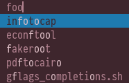

# fuzzyhighlight

## Description

Make dmenu highlight the fuzzy matching characters of items. Best used alongside
the [fuzzymatch](https://tools.suckless.org/dmenu/patches/fuzzymatch/) patch.

## Notes

- Supports case insensitive mode.
- Works without fuzzy matching (as a more flexible / expensive alternative to
  the [highlight](https://tools.suckless.org/dmenu/patches/highlight/) patch).

## Download

- [dmenu-fuzzyhighlight-4.9.diff](dmenu-fuzzyhighlight-4.9.diff)
- [dmenu-fuzzyhighlight-caseinsensitive-4.9.diff](dmenu-fuzzyhighlight-caseinsensitive-4.9.diff)
- [dmenu-fuzzyhighlight-5.3.diff](./dmenu-fuzzyhighlight-5.3.diff)

## Authors

- Chris Noxz - <chris@noxz.tech>
- Oleh Kopeykin - <olehkopeykin@yandex.by> (case-insensitive)
- Justinas Grigas <dev@jstnas.com> (5.3)
