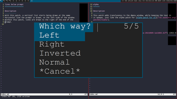
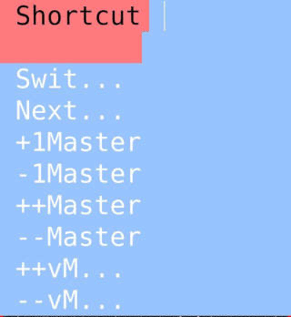

lines below prompt
==================

Description
-----------
With this patch, a vertical list starts being drawn at the same
horizontal line the prompt is drawn, on the left side of the window.
Without this patch, lines are drawn to the right of the end of the
prompt.

If you are concerned about space, you should use the 2021-11-01 patch, as it removes the subtraction of the prompt size.

Download
--------
* [dmenu-linesbelowprompt-20210703-1a13d04.diff](dmenu-linesbelowprompt-20210703-1a13d04.diff) (2021-07-03)
* [dmenu-linesbelowprompt-and-fullwidth-20211014.diff](dmenu-linesbelowprompt-and-fullwidth-20211014.diff) (2021-11-01)

Authors
-------
* Sebastian LaVine <mail@smlavine.com>
* fssSGJ <fssSGJ@mail.ch> (2021-11-01)
