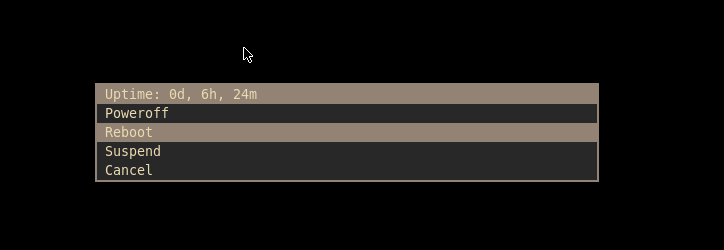
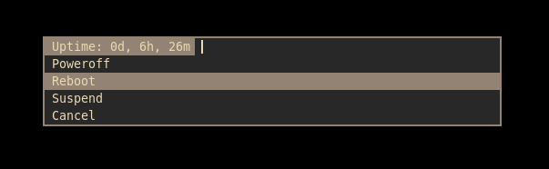

no input
======

Description
-----------
This patch removes the input box to create more aesthetic script menus.
Only intended to be used with a prompt, otherwise there will be an empty box.
There are two different patches, one with a modified [lines below prompt](https://tools.suckless.org/dmenu/patches/lines-below-prompt/) patch that fixes it with this patch.

Usage
-----
Pass along '-noi' with dmenu's arguments in your script to activate, or configure inside of config.def.h / config.h.

Example
-------
with patch:

without patch:

Download
--------
* [dmenu-noinput-5.2.diff](dmenu-noinput-5.2.diff) (2024-03-03)
* [dmenu-noinputlinesbelowpromptfullwidth-5.2.diff](dmenu-noinputlinesbelowpromptfullwidth-5.2.diff) (2024-03-03)

Author
-------
* [ozpv](https://github.com/ozpv)
